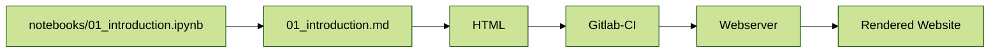

# Contributing

This project is a collaborative team effort, and we want to make contributing as easy as possible. This page provides a small workthrough for contributing to the [IOER RDC Geospatial Training Materials](https://training.fdz.ioer.info). Please note that you currently need to request access in order to participate. Please contact the IOER team.


*Made with❤️, Collaboration, and Open Source Software. Picture: 2021 Alexander Dunkel*

**Table of Contents**
- [1. Overview of files](#overview-of-files)
- [2. Publishing process](#publishing-process)
- [3. Editing files](#editing-files)
- [4. Jupyter Collaborative Editing](#jupyter-collaborative-editing)
   * [4.1 Start with editing a Jupyter notebook](#start-with-editing-a-jupyter-notebook)
   * [4.2 Open the Jupyter git extension](#open-the-jupyter-git-extension)
   * [4.3 Commit changes](#commit-changes)
   * [4.4 Write a commit message](#write-a-commit-message)
   * [4.5 Push changes to remote](#push-changes-to-remote)
   * [4.6 Wait for the website to update](#wait-for-the-website-to-update)
- [5. Git best practices](#git-best-practices)
- [6. Git best practices](#semantic-versioning)
- 
# 1. Overview of files

All documents are edited as Jupyter notebooks and can be found in the subfolder `notebooks/`:

- [00_toc.ipynb](https://gitlab.hrz.tu-chemnitz.de/ioer/fdz/jupyter-book-nfdi4biodiversity/-/blob/main/notebooks/00_toc.ipynb)
- [01_introduction.ipynb](https://gitlab.hrz.tu-chemnitz.de/ioer/fdz/jupyter-book-nfdi4biodiversity/-/blob/main/notebooks/01_introduction.ipynb)
- [02_theory_chapters.ipynb](https://gitlab.hrz.tu-chemnitz.de/ioer/fdz/jupyter-book-nfdi4biodiversity/-/blob/main/notebooks/02_theory_chapters.ipynb)
- [03_jupyter_notebooks.ipynb](https://gitlab.hrz.tu-chemnitz.de/ioer/fdz/jupyter-book-nfdi4biodiversity/-/blob/main/notebooks/03_jupyter_notebooks.ipynb)
- [04_example_introduction.ipynb](https://gitlab.hrz.tu-chemnitz.de/ioer/fdz/jupyter-book-nfdi4biodiversity/-/blob/main/notebooks/04_example_introduction.ipynb)
- [05_data_retrieval.ipynb](https://gitlab.hrz.tu-chemnitz.de/ioer/fdz/jupyter-book-nfdi4biodiversity/-/blob/main/notebooks/05_data_retrieval.ipynb)
- [06_analysis.ipynb](https://gitlab.hrz.tu-chemnitz.de/ioer/fdz/jupyter-book-nfdi4biodiversity/-/blob/main/notebooks/06_analysis-Copy1.ipynb)
- [07_visualizing.ipynb](https://gitlab.hrz.tu-chemnitz.de/ioer/fdz/jupyter-book-nfdi4biodiversity/-/blob/main/notebooks/07_visualizing.ipynb)
- [08_publish.ipynb](https://gitlab.hrz.tu-chemnitz.de/ioer/fdz/jupyter-book-nfdi4biodiversity/-/blob/main/notebooks/08_publish.ipynb)
- [09_endmatter-links.ipynb](https://gitlab.hrz.tu-chemnitz.de/ioer/fdz/jupyter-book-nfdi4biodiversity/-/blob/main/notebooks/09_endmatter-links.ipynb)
- [09_endmatter-thanks.ipynb](https://gitlab.hrz.tu-chemnitz.de/ioer/fdz/jupyter-book-nfdi4biodiversity/-/blob/main/notebooks/09_endmatter-thanks.ipynb)
- [10_milvus_maps.ipynb](https://gitlab.hrz.tu-chemnitz.de/ioer/fdz/jupyter-book-nfdi4biodiversity/-/blob/main/notebooks/10_milvus_maps.ipynb)
- [11_geosocialmedia.ipynb](https://gitlab.hrz.tu-chemnitz.de/ioer/fdz/jupyter-book-nfdi4biodiversity/-/blob/main/notebooks/11_geosocialmedia.ipynb)


# 2. Publishing process

Files are stored in [this git repository](https://gitlab.hrz.tu-chemnitz.de/ioer/fdz/jupyter-book-nfdi4biodiversity/). When changes are made to the notebook files, an automation is triggered to update the website at https://knowledge.fdz.ioer.info (git branch `main`) and https://stag.knowledge.fdz.ioer.info/ (git branch `staging`).

These two sites help to incrementally improve the training materials:
- https://stag.training.fdz.ioer.info/ - always up-to-date, see documentation changes immediately 
- https://training.fdz.ioer.info - a "production" version that looks more polished; changes from the staging branch are selectively merged in

Start working on the `staging` branch. We pull changes that are ready into the main (production) branch.

The process for a single notebook change:


# 3. Editing files

You _can_ edit these files from anywhere. However, depending on your knowledge of git, we suggest one of the following:

```{admonition} Request access to the Gitlab Chemnitz
:class: dropdown, attention
For IOER-Internal use only: In order to participate, [request access to the Gitlab Chemnitz Group](https://campus.fdz.ioer.info/sessions/2024-12-18_gitlab.html#workflow).
```

1. Use a common Jupyter Server for collaborative editing and follow the steps outlined under [4: Jupyter Collaborative Editing](#jupyter-collaborative-editing).
2. Edit files directly in [the Gitlab Repository](https://gitlab.hrz.tu-chemnitz.de/ioer/fdz/jupyter-book-nfdi4biodiversity/)
3. Clone [the repository](https://gitlab.hrz.tu-chemnitz.de/ioer/fdz/jupyter-book-nfdi4biodiversity/) locally and edit the Jupyter notebook files directly using your preferred environment. Only use this option if you are familiar with git!

# 4. Jupyter Collaborative Editing

Join a collaborative Jupyter session in your browser.

## 4.1 Start with editing a Jupyter notebook

```{figure} resources/01_edit_files.gif
:name: edit-files

Start with editing a Jupyter notebook.
```

Save changes to the notebook file with <kbd>CTRL+S</kbd>.


## 4.2 Open the Jupyter git extension

```{figure} resources/02_git_extension.gif
:name: edit-files

Find the JupyterLab Git extension.
```

Note that we are on the git branch called `staging`. We can also see that the notebook `01_introduction.ipynb` has changes that are not yet commited.


## 4.3 Commit changes

```{figure} resources/03_stage_changes.gif
:name: edit-files

"Staging" changes
```

For all changed files you want to update, click the `+` icon. This is called `staging` in git.


## 4.4 Write a commit message

```{figure} resources/04_commit_message.gif
:name: staging-changes

Write a commit message.
```

Write a short description of what the changes are, then click `commit`. You may be asked to enter your name and email once.


## 4.5 Push changes to remote

If you see an orange dot next to the left icon, click to first `pull` changes:
```{figure} resources/05_pull_changes.gif
:name: pull-changes

Click on "Pull changes from remote"
```

```{figure} resources/06_push_changes.gif
:name: push-changes

Click on "Push changes to remote".
```

## 4.6 Wait for the website to update

Head to https://gitlab.hrz.tu-chemnitz.de/ioer/fdz/jupyter-book-nfdi4biodiversity/-/pipelines and wait until the Continuous Integration pipeline finished updating the website.

This will take about 1-2 Minutes.

```{figure} resources/07_ci_pipeline.webp
:name: pipeline-passed

A passed pipeline with two stages (green checkmarks).
```

Once you see two green checkmarks, open the staging website and have a look at the updated website.

https://stag.training.fdz.ioer.info/

```{figure} resources/08_observe_changes.gif
:name: observe-changes

The rendered training materials with the changed text.
```

# 5. Git best practices

- Commit _often_. After any change, commit changes and push to remote. This also ensures your data is backed up and always up to date.
- When you start your day, always pull the latest changes from remote first. This ensures that you have the latest version locally and do not have to merge past changes later.
- If you want to maintain your work in progress, it is possible to store copies of notebooks under `tmp/` folder. Changes in this folder are ignored. Once you are happy with your
  progress, manually copy & paste cells or content to the original notebook files, to commit these changes.

# 6. Semantic Versioning

The book is automatically versioned using the [python-semantic-release](https://python-semantic-release.readthedocs.io/en/latest/). It follows the [Semantic Version Specification](https://semver.org/) (MAJOR.MINOR.PATCH). Please follow the [Semantic Commit Message Conventions](https://semantic-release.gitbook.io/semantic-release#commit-message-format). Our continuous integration will pick up commit messages and bump versions accordingly.

Since this training material consists of a mixture of code, comments, documentation and results, we suggest to follow the below examples.

## Documentation, descriptions or any code comments changed

Use:
```yml
docs: improved description of chapter 1
```

The same applies to minor changes such as fixing typos:
Use:
```yml
docs: fixed typo
```

These changes will not result in any version bump, but they will be listed as improvements under `Documentation` in the next release.

## Minor code changes, bug fixes

Use:
```yml
fix: issue with matplotlib and legend in figure 7
```

This will result in a new `patch` release.

##  Significant code changes, larger changes to the book structure


Use:
```yml
feat: added an interactive map (folium) to chapter 7
```

This will result in a new `minor` release.

## Changes to the Continuous Integration

Use:
```yml
ci: fix registry image not accessible
```

These changes will not result in any version bump, but they will be listed as improvements under `Continuous Integration` in the next release.

## Other commit messages

There are a number of other message types, such as `refactor`, `style`, (etc.). All of these will not cause a version bump and can be used if
and can be used if it fits.

# 7. Formatting conventions

We want to make sure that we systematically reuse certain visual elements in the training materials. This is a collection of agreed style conventions.

General conventions are:
- Use short sentences. As a guide, use no more than 10 to 15 words.
- Use the `.webp` format for figures. [Irfanview](https://www.irfanview.com/plugins.htm) with plugins comes with `webp` support, so it is easy to capture and save webp files.

## Check language and spelling (DeepL/Grammarly check)

Words convey meaning, so it is best to use simple and easy to understand sentences. Tools like [Grammarly](https://app.grammarly.com/) or [Linguee DeepL](https://www.deepl.com/) can help with this. Be sure to use American English for training materials.

```{figure} resources/linguee.webp
:name: linguee-grammarly

Linguee DeepL Grammar Check.
```


## Figure and Table formatting

See the [Jupyter Book docs](https://jupyterbook.org/en/stable/content/references.html#reference-section-labels) for how to create Figures and Tables with caption.

There is a `box-shadow` effect shown around figures by default. If you want to disable this on selected graphics, add `:figclass: fig-no-shadow` to the `{figure}`-tag.

```````{admonition} Like so
:class: dropdown, hint
``````
```{figure} ../resources/data-processing.png
:name: gbif-graphic
:figclass: fig-no-shadow

GBIF Data Processing Documentation 
```
``````
```````


## Cross-refererences

In order to not break cross-references, whenever using those, add an explicit cross-references anchor.
These will stay the same even if headers (etc.) change:

```
(content:references:explitanchor)=
## Reference section labels
```

Then use the anchor to create a cross-reference
```
[Link Text](content:references:explitanchor)
```

See [the docs](https://jupyterbook.org/en/stable/content/references.html#reference-section-labels)

## Requires user action (attention call)

Our goal is to make the training material interactive. The user can change certain parts of the code and this will affect the results of further processing.

To highlight where the user can make these changes, we use callouts (_admonitions_) with the `attention` flag. These callouts are highlighted in orange.
Below is an example that uses a `dropdown` in addition to the `attention` to further pique the user's curiosity.

```````{admonition} See example
:class: dropdown, hint
``````
```{admonition} Use your own common name!
:class: dropdown, attention
Optionally replace "English Sparrow" with another location above
```
``````

See in [action](content:references:admonition).

```````

## Admonitions

Admonitions can ease reading flows by highlighting certain paragraphs differently. 

```{figure} resources/admonition.webp
:name: admonition-example

Two admonitions (with the drop-down feature enabled).
```

In Markdown, formatting looks like this:
``````
:::{note}
Callout Text
:::
``````

:::{tip}
It is up to you whether you use `:::` or <code class="docutils literal notranslate"><span class="pre">```</span></code>.
:::

If you want to further replace the **title**:
``````
```{admonition} Use your own title
:class: note
Callout Text
```
``````

The full list of available admonitions can be found [in the sphinx-docs](https://sphinx-book-theme.readthedocs.io/en/stable/reference/kitchen-sink/admonitions.html).

The use of admonitions sometimes requires to _nest_ different outputs. For example, maybe you want to show a code block inside an admonition. In this case, adding backticks (\`) to the outer block need to be used.

```````{admonition} See example
:class: dropdown, hint
``````
````{admonition} Use your own common name!
:class: dropdown, attention
Optionally replace "English Sparrow" with another location above
```python
# code block
```
````
``````
```````

In other cases, you may want to show images or other output rendered in a cell inside admonitions (e.g.). This is done with the `glue`-directive. See the [Jupyter book docs](https://jupyterbook.org/en/stable/content/executable/output-insert.html). There is also an example in the file `202_data_retrieval.ipynb`, [see the result here](content:references:glue-example).

## Overview first, details on demand

Overview first, details on demand ([Schneiderman’s Mantra](https://hampdatavisualization.wordpress.com/2016/02/26/schneidermans-mantra/): Admonitions with drop-down are a good way to hide too much information in Markdown cells.

Another way to hide information in input and output cells are [cell tags](https://jupyterbook.org/en/stable/content/metadata.html).

For example, to hide a long cell output, add `hide-output` to cell metadata. You can find cell metadata on the upper-right corner in Jupyter.

```{figure} resources/hide-tag.webp
:name: hide-example

Add `hide-output` to a cell's metadata to hide its output with a drop-down link.
```