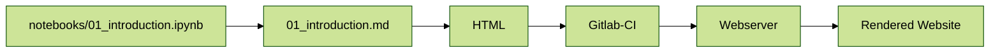

# Contributing

This project is a collaborative team effort, and we want to make contributing as easy as possible. This page provides a small workthrough for contributing to the [IOER FDZ Geospatial Training Materials](https://training.fdz.ioer.info). We have a [public mirror of the Repository on Github](https://github.com/ioer-dresden/jupyter-book-nfdi4biodiversity). If you have any questions, please open a new discussion on GitHub. If you would like to contribute, we welcome any merge requests. For bug reports and other issues, use the GitHub issue tracker or contact the IOER FDZ team.


*Made with❤️, Collaboration, and Open Source Software. Picture: 2021 Alexander Dunkel*

**Table of Contents**
- [1. Overview of files](#overview-of-files)
- [2. Publishing process](#publishing-process)
- [3. Editing files](#editing-files)
- [4. Jupyter Collaborative Editing](#jupyter-collaborative-editing)
   * [4.1 Start with editing a Jupyter notebook](#start-with-editing-a-jupyter-notebook)
   * [4.2 Open the Jupyter git extension](#open-the-jupyter-git-extension)
   * [4.3 Commit changes](#commit-changes)
   * [4.4 Write a commit message](#write-a-commit-message)
   * [4.5 Push changes to remote](#push-changes-to-remote)
   * [4.6 Wait for the website to update](#wait-for-the-website-to-update)
- [5. Git best practices](#git-best-practices)
- [6. Semantic Versioning](#semantic-versioning)
- [7. Formatting conventions](#formatting-conventions)
- [8. Citations, references](#citations-references)
- [9. Reproducible Science in Action: Carto-Lab Docker](#reproducible-science-in-action-carto-lab-docker)


(heading-target)=
# 1. Overview of files

All documents are edited as Jupyter notebooks and can be found in the subfolder `notebooks/`, e.g.:

- [00_toc.ipynb](https://gitlab.hrz.tu-chemnitz.de/ioer/fdz/jupyter-book-nfdi4biodiversity/-/blob/main/notebooks/00_toc.ipynb)
- [101_theory_chapters.ipynb](https://gitlab.hrz.tu-chemnitz.de/ioer/fdz/jupyter-book-nfdi4biodiversity/-/blob/main/notebooks/101_theory_chapters.ipynb)
- [102_jupyter_notebooks.ipynb](https://gitlab.hrz.tu-chemnitz.de/ioer/fdz/jupyter-book-nfdi4biodiversity/-/blob/main/notebooks/102_jupyter_notebooks.ipynb)
- [201_example_introduction.ipynb](https://gitlab.hrz.tu-chemnitz.de/ioer/fdz/jupyter-book-nfdi4biodiversity/-/blob/main/notebooks/201_example_introduction.ipynb)

<br>

-   **File Inventory (Key Directories and Files):**
    -   `notebooks/`: Contains the core content as Jupyter Notebook (`.ipynb`) files. These include theoretical explanations and practical coding exercises.
    -   `00_data/`: Contains example base data files used in some notebooks, such as Biotope data for Dresden (`Biotopwerte_Dresden_2018.*`), an example GBIF query result (`occurrences_query.csv`), and other supporting data like `clc_legend.csv`.
    -   `out/`: Contains example output files generated by running the code in the Jupyter notebooks (e.g., `release_v1.8.0.zip`, GeoPackages/Shapefiles with processed spatial data like `clipped.gpkg`, raster files like `S12RG_2023_200m_DE.tif`, figures, HTML maps). These represent results from a specific run at the time of archival.
    -   `py/modules/`: Contains auxiliary Python scripts (`.py`) with helper functions used within the notebooks.
    -   `resources/`: Contains static image files (`.png`, `.gif`, `.webp`, `.jpg`) and other resources embedded within the notebooks or used in the documentation.
    -   `_static/`: Contains static assets (CSS, fonts, images, videos) for building the Jupyter Book HTML website.
    -   `_ext/`: Custom extensions for the Jupyter Book build process (customized APA citation style).
    -   `scripts/`: Utility scripts (e.g., `patch_binder_links.sh` for Jupyter4NFDI resource override).
    -   `tests/`: Test scripts (e.g., `link-check.sh` for cross-reference & website link integrity).
    -   `.pandoc/`: Configuration and assets for Pandoc-based README rendering.
    -   `.templates/`: Templates, e.g., for `CHANGELOG.md` generation.
    -   `tmp/`: Temporary files or source data for processing (e.g., `vg2500` administrative boundaries). Note: Data in `tmp/` is intermediate and not directly part of the final curated dataset examples in `00_data/`.
    -   `_config.yml`, `_toc.yml`: Configuration files for the Jupyter Book build process.
    -   `pyproject.toml`: Defines Python project dependencies for reproducibility.
    -   `.gitlab-ci.yml`: GitLab CI/CD pipeline configuration for automating build and deployment.
    -   `LICENSE.md`: License information for the repository content.
    -   `README.md`: This file.
    -   `CONTRIBUTING.md`: Guidelines for contributing.
    -   `CHANGELOG.md`: Records changes across versions.
    -   `references.bib`, `BIBLIOGRAPHY.md`: Bibliographic information.
    -   Other configuration files (`.gitignore`, `.version`, `conf.json`, `nbconvert.tpl`, etc.).

-   **Versioning:**
    -   The repository uses Git for version control.
    -   Semantic Versioning is applied, managed with [python-semantic-release](https://python-semantic-release.readthedocs.io/en/latest/).
    -   Versions follow the [Semantic Version Specification](https://semver.org/) (MAJOR.MINOR.PATCH). 
    -   Commit messages follow the [Conventional Commits Specification v1.0.0](https://www.conventionalcommits.org/en/v1.0.0/)
    -   This replication package corresponds to **Version 1.8.0**.

-   **File Relationships:**
    -   Jupyter notebooks in `notebooks/` are primary source files.
    -   Notebooks read input data from external APIs (GBIF, IOER Monitor) or example files in `00_data/`.
    -   Running code in notebooks generates output files in `out/`.
    -   Helper functions from `py/modules/` are used in notebooks.
    -   `.gitlab-ci.yml` is the central CI&CD pipeline configuration; uses Jupyter Book (`_config.yml`, `_toc.yml`) to build the HTML website.
    -   `pyproject.toml` lists Python dependencies.

-   **Additional Materials:**
    -   The live, rendered version of these training materials is available at: [https://training.fdz.ioer.info/](https://training.fdz.ioer.info/)
    -   A public mirror of the development repository is available on GitHub: [https://github.com/ioer-dresden/jupyter-book-nfdi4biodiversity](https://github.com/ioer-dresden/jupyter-book-nfdi4biodiversity)

(heading-target)=
# 2. Publishing process

Files are stored in [this git repository](https://gitlab.hrz.tu-chemnitz.de/ioer/fdz/jupyter-book-nfdi4biodiversity/). When changes are made to the notebook files, an automation is triggered to update the website at https://training.fdz.ioer.info (git branch `main`) and https://stag.training.fdz.ioer.info/ (git branch `staging`).

These two sites help to incrementally improve the training materials:
- https://stag.training.fdz.ioer.info/ - always up-to-date, see documentation changes immediately. **This page is only visible from the IOER Intranet**
- https://training.fdz.ioer.info - a "production" version that looks more polished; changes from the staging branch are selectively merged in. This page is **publicly visible**

Start working on the `staging` branch. We pull changes that are ready into the main (production) branch.

The process for a single notebook change:

```mermaid 
%%{init: { 'theme':'forest', 'securityLevel': 'loose', 'sequence': {'useMaxWidth':false} } }%%
flowchart LR;
   notebooks/01_introduction.ipynb-->01_introduction.md-->HTML-->Gitlab-CI-->Webserver-->target[Rendered Website]
```

(heading-target)=
# 3. Editing files

You _can_ edit these files from anywhere. However, depending on your knowledge of git, we suggest one of the following:

```{admonition} Request access to the Gitlab Chemnitz
:class: dropdown, attention
For IOER-Internal use only: In order to participate, [request access to the Gitlab Chemnitz Group](https://campus.fdz.ioer.info/sessions/2024-12-18_gitlab.html#workflow).
```

1. Use a common Jupyter Server for collaborative editing and follow the steps outlined under [4: Jupyter Collaborative Editing](#jupyter-collaborative-editing).
2. Edit files directly in [the Gitlab Repository](https://gitlab.hrz.tu-chemnitz.de/ioer/fdz/jupyter-book-nfdi4biodiversity/)
3. Clone [the repository](https://gitlab.hrz.tu-chemnitz.de/ioer/fdz/jupyter-book-nfdi4biodiversity/) locally and edit the Jupyter notebook files directly using your preferred environment. Only use this option if you are familiar with git!

(heading-target)=
# 4. Jupyter Collaborative Editing

Join a collaborative Jupyter session in your browser.

(heading-target)=
## 4.1 Start with editing a Jupyter notebook

```{figure} resources/01_edit_files.gif
:name: edit-files

Start with editing a Jupyter notebook.
```

Save changes to the notebook file with <kbd>CTRL+S</kbd>.

(heading-target)=
## 4.2 Open the Jupyter git extension

```{figure} resources/02_git_extension.gif
:name: edit-files

Find the JupyterLab Git extension.
```

Note that we are on the git branch called `staging`. We can also see that the notebook `01_introduction.ipynb` has changes that are not yet commited.

(heading-target)=
## 4.3 Commit changes

```{figure} resources/03_stage_changes.gif
:name: stage-files

"Staging" changes
```

For all changed files you want to update, click the `+` icon. This is called `staging` in git.

(heading-target)=
## 4.4 Write a commit message

```{figure} resources/04_commit_message.gif
:name: staging-changes

Write a commit message.
```

Write a short description of what the changes are, then click `commit`. You may be asked to enter your name and email once.

(heading-target)=
## 4.5 Push changes to remote

If you see an orange dot next to the left icon, click to first `pull` changes:
```{figure} resources/05_pull_changes.gif
:name: pull-changes

Click on "Pull changes from remote"
```

```{figure} resources/06_push_changes.gif
:name: push-changes

Click on "Push changes to remote".
```

(heading-target)=
## 4.6 Wait for the website to update

Head to https://gitlab.hrz.tu-chemnitz.de/ioer/fdz/jupyter-book-nfdi4biodiversity/-/pipelines and wait until the Continuous Integration pipeline finished updating the website.

This will take about 1-2 Minutes.

```{figure} resources/07_ci_pipeline.webp
:name: pipeline-passed

A passed pipeline with two stages (green checkmarks).
```

Once you see two green checkmarks, open the staging website and have a look at the updated website.

https://stag.training.fdz.ioer.info/

```{figure} resources/08_observe_changes.gif
:name: observe-changes

The rendered training materials with the changed text.
```

(heading-target)=
# 5. Git best practices

- Commit _often_. After any change, commit changes and push to remote. This also ensures your data is backed up and always up to date.
- When you start your day, always pull the latest changes from remote first. This ensures that you have the latest version locally and do not have to merge past changes later.
- If you want to maintain your work in progress, it is possible to store copies of notebooks under `tmp/` folder. Changes in this folder are ignored. Once you are happy with your
  progress, manually copy & paste cells or content to the original notebook files, to commit these changes.

(heading-target)=
# 6. Semantic Versioning

The book is automatically versioned using the [python-semantic-release](https://python-semantic-release.readthedocs.io/en/latest/). It follows the [Semantic Version Specification](https://semver.org/) (MAJOR.MINOR.PATCH). Please follow the [Conventional Commits Specification](https://www.conventionalcommits.org/en/v1.0.0/) for writing your commit messages (see also [Semantic Commit Message Conventions](https://semantic-release.gitbook.io/semantic-release#commit-message-format)). Our continuous integration will pick up commit messages, bump versions accordingly, and update [the Changelog](CHANGELOG).

Since these training materials consists of a mixture of code, comments, documentation and results, we suggest to follow the below examples.

(heading-target)=
## Documentation, descriptions or any code comments changed

Use:
```yaml
docs: improved description of chapter 1
```

The same applies to minor changes such as fixing typos:
Use:
```yaml
docs: fixed typo
```

These changes will not result in any version bump, but they will be listed as improvements under `Documentation` in the next release.

(heading-target)=
## Minor code changes, bug fixes

Use:
```yaml
fix: issue with matplotlib and legend in figure 7
```

This will result in a new `patch` release.

(heading-target)=
##  Significant code changes, larger changes to the book structure


Use:
```yaml
feat: added an interactive map (folium) to chapter 7
```

This will result in a new `minor` release.

(heading-target)=
## Changes to the Continuous Integration

Use:
```yaml
ci: fix registry image not accessible
```

These changes will not result in any version bump, but they will be listed as improvements under `Continuous Integration` in the next release.

(heading-target)=
## Other commit messages

There are a number of other message types, such as `refactor`, `style`, (etc.). All of these will not cause a version bump and can be used if
and can be used if it fits.

(heading-target)=
# 7. Formatting conventions

We want to make sure that we systematically reuse certain visual elements in the training materials. This is a collection of agreed style conventions.

General conventions are:
- Use short sentences. As a guide, use no more than 10 to 15 words.
- Use the `.webp` format for figures. [Irfanview](https://www.irfanview.com/plugins.htm) with plugins comes with `webp` support, so it is easy to capture and save webp files.

(heading-target)=
## Check language and spelling (DeepL/Grammarly check)

Words convey meaning, so it is best to use simple and easy to understand sentences. Tools like [Grammarly](https://app.grammarly.com/) or [Linguee DeepL](https://www.deepl.com/) can help with this. Be sure to use American English for training materials.

```{figure} resources/linguee.webp
:name: linguee-grammarly

Linguee DeepL Grammar Check.
```

(heading-target)=
## Figure and Table formatting

See the [Jupyter Book docs](https://jupyterbook.org/en/stable/content/references.html#reference-section-labels) on how to create Figures and Tables with caption.

There is a `box-shadow` effect shown around figures by default. If you want to disable this on selected graphics, add `:figclass: fig-no-shadow` to the `{figure}`-tag.

```````{admonition} Like so
:class: dropdown, hint
``````
```{figure} ../resources/data-processing.png
:name: gbif-graphic
:figclass: fig-no-shadow

GBIF Data Processing Documentation 
```
``````
```````

(heading-target)=
## Cross-refererences

In order to not break cross-references, whenever using those, add an explicit cross-references anchor.
These will stay the same even if headers (etc.) change:

```
(content:references:explitanchor)=
## Reference section labels
```

Then use the anchor to create a cross-reference
```
[Link Text](content:references:explitanchor)
```

See [the docs](https://jupyterbook.org/en/stable/content/references.html#reference-section-labels)

(heading-target)=
## Requires user action (attention call)

Our goal is to make the training material interactive. The user can change certain parts of the code and this will affect the results of further processing.

To highlight where the user can make these changes, we use callouts (_admonitions_) with the `attention` flag. These callouts are highlighted in orange.
Below is an example that uses a `dropdown` in addition to the `attention` to further pique the user's curiosity.

```````{admonition} See example
:class: dropdown, hint
``````
```{admonition} Use your own common name!
:class: dropdown, attention
Optionally replace "English Sparrow" with another location above
```
``````

See in [action](content:references:admonition).

```````

(heading-target)=
## Admonitions

Admonitions can ease reading flows by highlighting certain paragraphs differently. 

```{figure} resources/admonition.webp
:name: admonition-example

Two admonitions (with the drop-down feature enabled).
```

In Markdown, formatting looks like this:
``````
:::{note}
Callout Text
:::
``````

:::{tip}
It is up to you whether you use `:::` or <code class="docutils literal notranslate"><span class="pre">```</span></code>.
:::

If you want to further replace the **title**:
``````
```{admonition} Use your own title
:class: note
Callout Text
```
``````

The full list of available admonitions can be found [in the sphinx-docs](https://sphinx-book-theme.readthedocs.io/en/stable/reference/kitchen-sink/admonitions.html).

The use of admonitions sometimes requires to _nest_ different outputs. For example, maybe you want to show a code block inside an admonition. In this case, adding backticks (\`) to the outer block need to be used.

```````{admonition} See example
:class: dropdown, hint
``````
````{admonition} Use your own common name!
:class: dropdown, attention
Optionally replace "English Sparrow" with another location above
```python
# code block
```
````
``````
```````

In other cases, you may want to show images or other output rendered in a cell inside admonitions (e.g.). This is done with the `glue`-directive. See the [Jupyter book docs](https://jupyterbook.org/en/stable/content/executable/output-insert.html). There is also an example in the file `202_data_retrieval.ipynb`, [see the result here](content:references:glue-example).

(heading-target)=
## Overview first, details on demand

Overview first, details on demand ([Schneiderman’s Mantra](https://hampdatavisualization.wordpress.com/2016/02/26/schneidermans-mantra/)): Admonitions with drop-down are a good way to hide too much information in Markdown cells.

Another way to hide information in input and output cells are [cell tags](https://jupyterbook.org/en/stable/content/metadata.html).

For example, to hide a long cell output, add `hide-output` to cell metadata. You can find cell metadata on the upper-right corner in Jupyter.

```{figure} resources/hide-tag.webp
:name: hide-example

Add `hide-output` to a cell's metadata to hide its output with a drop-down link.
```

# 8. Citations, references

Citations are managed with [sphinxcontrib-bibtex](https://github.com/mcmtroffaes/sphinxcontrib-bibtex). See the Jupyter Book docs [here](https://jupyterbook.org/en/stable/content/citations.html).

**1. Add bib-metadata**

In order to add literature, first add the reference (`*.bib` format) to `references.bib` file in the root or the repository.
```{admonition} How to get the bib format?
:class: hint
You can sometimes download `*.bib`-metadata as "citations" from publication pages. Otherwise, use e.g. Zotero to export the publication to a `*.bib` file, open it, and copy the contents to `references.bib`.
```

**2. Get reference**

Your newly added bib-entry has a unique identifier, e.g. `dworczyk_replication_2025`. Memorize this reference.

**3. Use reference**

Depending on how you want to use the reference, these are some examples:

```
{cite:ts}`salek_house_2015`
```

will be rendered as (full author list, without *et al.*):

> [Šálek, Riegert, and Grill (2015)](/notebooks/201_example_introduction.html#id9)

```
{cite:t}`fischer_2023_10377868`
```

will be rendered as (in-text):

> [Fischer *et al.* (2023)](/notebooks/101_theory_chapters.html#id22).

```
The **F**indable **A**cessible **I**nteroperable **R**eusable (**FAIR**) principles *({cite:alp}`wilkinson_fair_2016`)*
```

will be rendered as (no parenthesis)

> The **F**indable **A**cessible **I**nteroperable **R**eusable (**FAIR**) principles *([Wilkinson \*et al.\* 2016](/notebooks/101_theory_chapters.html#id23))* 


**4. Add a chapter bibliography**

If you want to show a list of references used at the end of each notebook, add the follow to the last cell of your notebook:
``````
## References

```{bibliography}
:style: unsrt
:filter: docname in docnames
```
``````

**5. Add a global bibliography**

Create a new file `BIBLIOGRAPHY.md` and add:
``````
# Bibliography

```{bibliography} references.bib
:style: plain
```
``````

Link this file in the `_toc.yml`. This will list all references used throughout your book.

# 9. Reproducible Science in Action: Carto-Lab Docker

If you want to know more about the technical infrastructure and Reasearch Data Management (RDM) concept behind the training materials,
have a look at our [IOER FDZ Carto-Lab Docker documentation](https://cartolab.fdz.ioer.info/). We also presented these Training Materials,
together with the Carto-Lab Docker at the 2nd Conference on Research Data Infrastructure (CoRDI 2025) in Aachen, Germany. 
The poster provides a comprehensive visual summary of the Carto-Lab Docker RDM philosophy, its three-pillar architecture, and use cases such 
as the training materials.

```{figure} resources/rdm-flow.svg
:name: rdm-philosophy

The research data management philosophy behind the training materials - turning good RDM practices from a theoretical ideal into a practical reality. Read further [here](https://cartolab.fdz.ioer.info/concept/).
```


```{figure} resources/2025-08-21_poster_cordi.png
:name: cordi-poster

The poster about the training materials and the Carto-Lab Docker that we presented at the 2nd Conference on Research Data Infrastructure (CoRDI 2025) in Aachen, Germany. A PDF is available [here](https://cartolab.fdz.ioer.info/assets/2025-08-21_poster_cordi.pdf).
```
